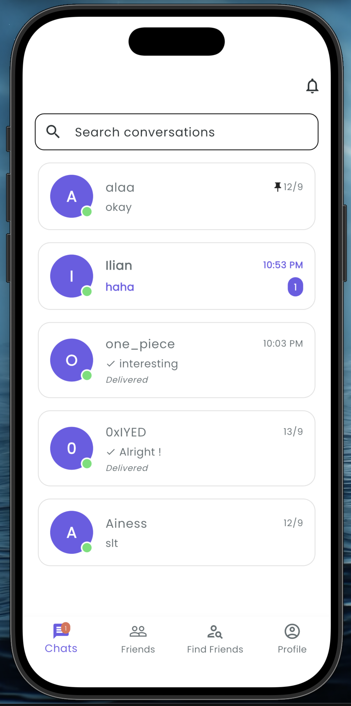
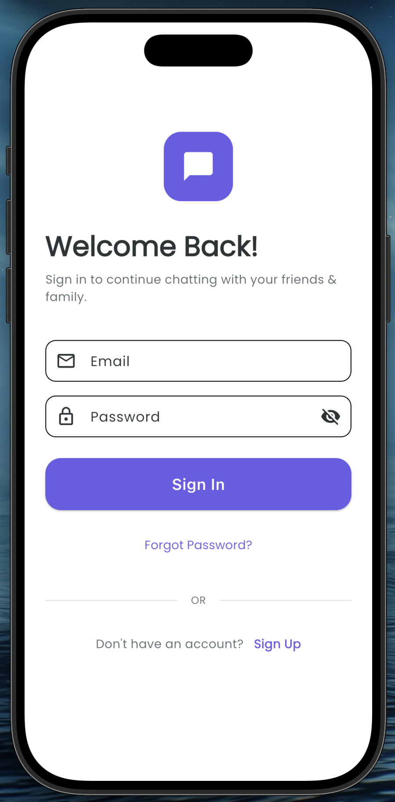
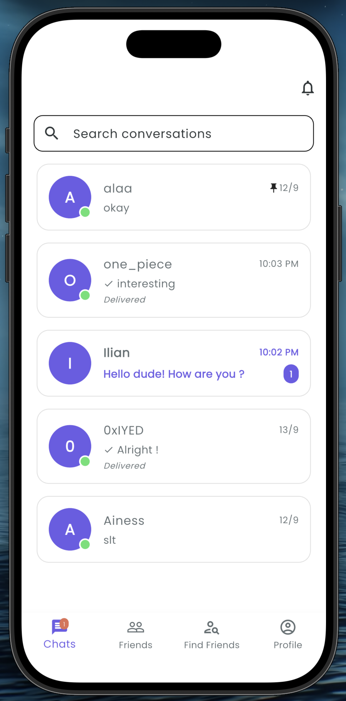
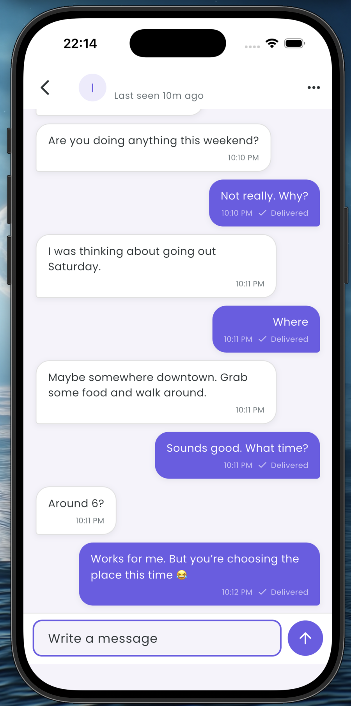
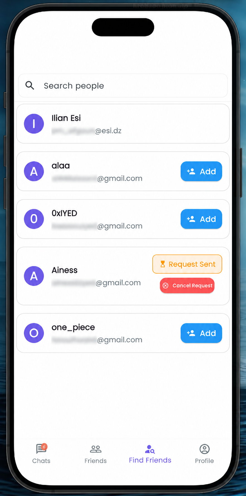
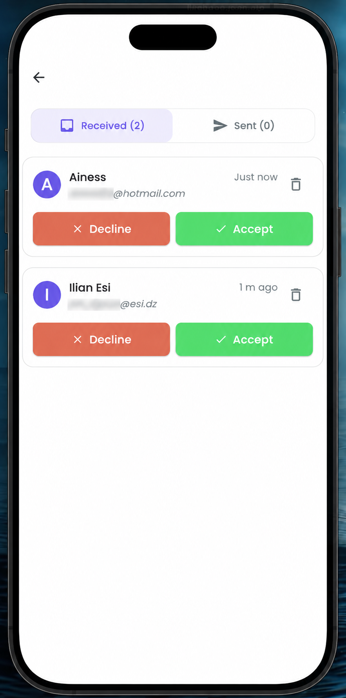
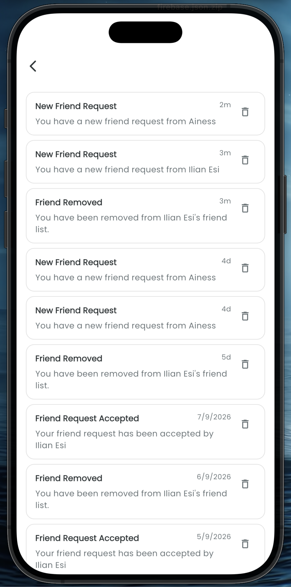
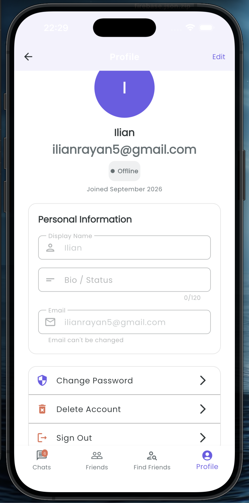
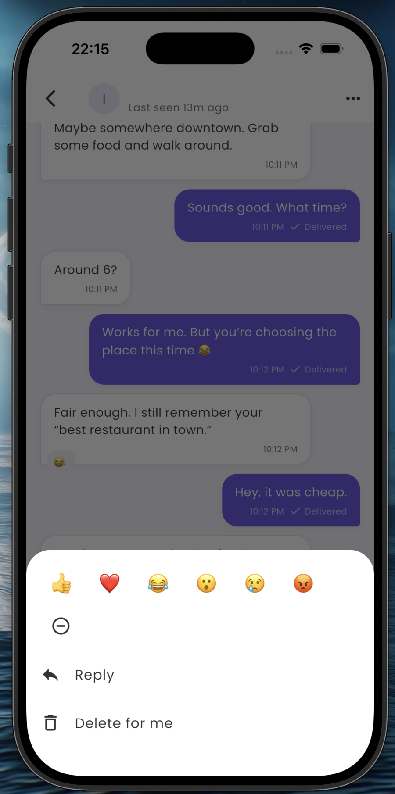

# ChatApp

> A Flutter-based one-to-one messaging application built with **GetX** and **Firebase**, featuring real-time conversations, friendship management, presence, read states, message interactions, and account controls.

ChatApp is a portfolio project focused on building a complete social messaging flow rather than only a chat screen — from authentication and finding people to friend relationships, real-time conversations, notifications, and privacy controls.

---

##  Features

### 🔐 Authentication & Account

- Email/password registration and sign-in
- Persistent authentication state
- Password reset by email
- Change password with reauthentication
- Sign out
- Account deletion
- Automatic navigation based on authentication state

### 👥 Friends & Social System

- Browse and search users
- Send friend requests
- Accept or decline received requests
- Cancel sent requests
- Remove friends
- View sent and received request history
- Relationship-state handling (`none`, request sent, request received, friends, blocked)
- Start a conversation from a friendship

### 💬 Real-Time Messaging

- One-to-one conversations
- Real-time Firestore message synchronization
- Text messages
- Delivered and read states
- Unread message counters
- Typing indicator
- Online/offline presence
- Last-seen information
- Reply to messages
- Swipe-to-reply interaction
- Emoji reactions
- Delete a message for yourself
- Delete a message for everyone
- Per-user chat deletion and restoration
- Pin/unpin conversations
- Search conversations by user or message content

### 🔔 Notifications

The application currently generates and displays notifications for friendship-related events:

- New friend requests
- Accepted friend requests
- Declined friend requests
- Friend removals
- Unread notification counters
- Mark notification as read
- Mark all notifications as read
- Delete notifications
- Open notifications to the relevant application section

### 👤 Profiles

- Display name
- Bio / status
- Email display
- Online/offline state
- Last-seen information
- Public user profile view
- Profile editing

> Profile photo updating is not implemented yet in the current application.

---

## 🧰 Tech Stack

| Technology | Purpose |
|---|---|
| **Flutter / Dart** | Cross-platform application and UI |
| **GetX** | State management, dependency injection, and navigation |
| **Firebase Authentication** | User registration, login, password reset, password changes, account deletion |
| **Cloud Firestore** | Users, friendships, friend requests, chats, messages, and notifications |
| **Google Fonts** | Poppins-based application typography |
| **UUID** | Unique identifiers for friend requests and messages |
| **Visibility Detector** | Notification visibility/read behavior |

The project also includes Firebase Storage security rules prepared for future media support.

The main package configuration is defined in `pubspec.yaml`.

---

## 🏗️ Architecture

ChatApp uses a feature-oriented Flutter structure built around **controllers, models, services, views, routes, and a shared theme**.

```text
lib/
├── controllers/
│   ├── auth_controller.dart
│   ├── change_password_controller.dart
│   ├── chat_controller.dart
│   ├── forgot_password_controller.dart
│   ├── friend_requests_controller.dart
│   ├── friends_controller.dart
│   ├── home_controller.dart
│   ├── main_controller.dart
│   ├── notifications_controller.dart
│   ├── profile_controller.dart
│   └── users_list_controller.dart
│
├── models/
│   ├── chat_model.dart
│   ├── friend_request_model.dart
│   ├── friendship_model.dart
│   ├── message_model.dart
│   ├── notification_model.dart
│   └── user_model.dart
│
├── routes/
│   ├── app_pages.dart
│   └── app_routes.dart
│
├── services/
│   ├── auth_service.dart
│   └── firestore_service.dart
│
├── theme/
│   └── app_theme.dart
│
├── view/
│   ├── auth/
│   ├── Profile/
│   ├── widgets/
│   ├── chat_view.dart
│   ├── friends_view.dart
│   ├── friend_requests_view.dart
│   ├── home_view.dart
│   └── notifications_view.dart
│
├── firebase_options.dart
└── main.dart
```

### Responsibilities

**Controllers**

Handle UI-facing application state and coordinate interactions between views and services using GetX reactive state.

**Models**

Represent Firestore-backed entities such as users, chats, messages, friendships, friend requests, and notifications.

**Services**

Encapsulate Firebase operations. `AuthService` handles Firebase Authentication while `FirestoreService` contains the Firestore data-access and synchronization logic.

**Views**

Contain the user interface for authentication, conversations, friends, user discovery, profiles, friend requests, and notifications.

**Routes**

Centralize named application routes and attach controllers to the relevant screens through GetX bindings.

**Theme**

Provides the shared Material 3 visual system, colors, typography, cards, inputs, buttons, and other reusable styling.

The route table and controller bindings are centralized in `app_pages.dart`.

---

## 🔥 Firebase Architecture

Firebase is initialized at application startup using the generated FlutterFire configuration.

```text
Flutter App
    │
    ├── Firebase Authentication
    │      └── user identity / session
    │
    └── Cloud Firestore
           ├── users
           ├── friend_requests
           ├── friendships
           ├── chats
           ├── messages
           └── notifications
```

Firebase initialization is performed in `main.dart` through `DefaultFirebaseOptions.currentPlatform`.

### `users`

Stores application-level user information including:

- `id`
- `email`
- `displayName`
- `bio`
- `photoURL`
- `blockedUserIds`
- `isOnline`
- `lastSeen`
- `createdAt`

The model uses Firestore `Timestamp` values for `lastSeen` and `createdAt`.

### `friend_requests`

Friend requests track:

```text
senderId
receiverId
status
createdAt
respondedAt
message
```

Supported statuses:

```text
pending
accepted
declined
```

### `friendships`

Friendships use a deterministic document ID generated from the two sorted user IDs.

The model stores:

```text
user1Id
user2Id
createdAt
isBlocked
blockedBy
```

### `chats`

A one-to-one chat is identified using the sorted participant IDs:

```text
{smallerUid}_{largerUid}
```

A chat stores conversation-level state such as:

```text
participants
lastMessage
lastMessageTime
lastMessageSenderId
unreadCount
deletedBy
deletedAt
lastSeenBy
typing
pinnedBy
createdAt
updatedAt
```

This design allows conversation state to remain shared while still supporting per-user state such as pinning, unread counters, and chat deletion.

### `messages`

Messages are stored independently from the chat document.

The current model supports **text messages** and stores:

```text
id
senderId
receiverId
content
type
timestamp
isRead
isDelivered
isEdited
reactions
editedAt
replyToMessageId
replyToContent
replyToSenderId
```

For a conversation, the application listens to the two possible sender/receiver directions, merges the resulting documents, removes duplicates, applies per-user deletion rules, and sorts them chronologically.

### `notifications`

Notifications contain:

```text
id
userId
title
body
type
data
isRead
createdAt
```

Current notification types include:

```text
friendRequest
friendRequestAccepted
friendRequestDeclined
friendRemoved
```

The code also defines `newMessage`, but the notification service explicitly suppresses that type.

---

## 🔐 Security

The repository includes dedicated Firestore and Storage security rules.

### Firestore

The rules enforce authentication and ownership/participation checks across the main collections.

Examples:

- Users can only create, update, or delete their own user document.
- Messages can only be created by the authenticated sender.
- Existing messages can only be updated by one of the two participants.
- Chats can only be created and updated by participants.
- Friend requests can only be updated by the receiving user.
- Friendships are restricted to the two participants.
- Notifications can only be read, updated, or deleted by their owner.

The rules also check whether users are blocked before allowing new conversations, messages, or friendship-related writes.

### Storage

The repository contains a Storage rule for:

```text
chat_media/{chatId}/{fileName}
```

Read/write access is restricted to authenticated users who are participants in the corresponding chat document.

> **Security note:** these rules are part of the project configuration, but the current application does not yet contain the media-upload implementation that would make `chat_media` an active application feature.

---

## 🧠 Technical Challenges

### Real-Time Synchronization

The messaging layer relies on Firestore snapshot streams rather than manual polling. The application simultaneously listens to messages in both directions and merges them into a single chronological conversation.

### Read Receipts & Unread Counters

Read state exists at multiple levels:

```text
Message
├── isRead
└── isDelivered

Chat
├── unreadCount[userId]
└── lastSeenBy[userId]
```

Opening a conversation can mark unread messages as read and reset the corresponding conversation counter.

### Typing Indicators

Typing state is stored in the chat document as a per-user map:

```text
typing.{userId} = true / false
```

The UI reads this state through a real-time chat listener.

### Per-User Chat Deletion

Deleting a conversation does not remove the shared chat document. Instead, the application records:

```text
deletedBy.{userId}
deletedAt.{userId}
```

Messages older than the user's deletion timestamp are then filtered from that user's view. Starting the conversation again restores it for that user.

### Message Deletion

Message deletion is implemented with metadata/redaction rather than simply removing every trace of the message.

The application supports:

- Delete for me
- Delete for everyone

The conversation preview is also updated when the deleted message was the latest message.

### Relationship State Management

The user-discovery flow derives a relationship state from friendships and friend-request streams:

```text
none
friendRequestSent
friendRequestReceived
friends
blocked
```

That state determines which action is available in the UI.

### Firestore Query Indexes

The project commits `firestore.indexes.json` for compound queries involving:

- conversations
- notifications
- sent friend requests
- received friend requests

This prevents the application from depending only on manually created indexes in a Firebase console.

---

## 🎬 Demo

A short demonstration of ChatApp showcasing real-time messaging, friend management, notifications, read receipts, reactions, replies, and profile features.

CLICK AT THE PHOTO BELOW👇

<a href="https://youtu.be/ep2rBtzehQQ">
  
</a>
---

## 📱 Screenshots

| Login | Chats |
|---|---|
|  |  |

| Conversation | Find People |
|---|---|
|  |  |

| Friend Requests | Notifications |
|---|---|
|  |  |

| Profile | Message Actions |
|---|---|
|  |  |

---

## ⚙️ Installation

### Prerequisites

Make sure the development environment has:

- Flutter SDK
- Dart SDK compatible with the project's configured SDK constraint
- Android Studio / Android SDK for Android development
- Xcode for iOS development on macOS
- A Firebase project

The repository currently targets Dart SDK `^3.12.2`.

### 1. Clone the repository

```bash
git clone https://github.com/ilian0410/chat-app.git
cd chat-app
```

### 2. Install dependencies

```bash
flutter pub get
```

### 3. Configure Firebase

Follow the Firebase setup section below before launching the application.

---

## 🔥 Firebase Setup

This project uses Firebase Authentication and Cloud Firestore.

For your own Firebase project:

### Enable Firebase Authentication

Enable the **Email/Password** provider in Firebase Authentication.

The application uses Firebase Authentication for registration, sign-in, password reset, password changes, and account deletion.

### Create Firestore

Create a Cloud Firestore database and deploy the repository's rules and indexes:

```bash
firebase deploy --only firestore:rules,firestore:indexes
```

The project references:

```text
firestore.rules
firestore.indexes.json
```

through `firebase.json`.

### Configure Firebase for Flutter

The project uses FlutterFire-generated `firebase_options.dart`. Reconfigure it for your own Firebase project:

```bash
flutterfire configure
```

Then verify that the generated configuration matches your Firebase applications.

### Firebase Storage

Storage rules are included in:

```text
storage.rules
```

Deploy them with:

```bash
firebase deploy --only storage
```

At the moment, the application does not implement the corresponding media-upload flow, so Storage should be treated as prepared infrastructure rather than an active user-facing feature.

> **Never commit private credentials, service-account keys, or other server-side secrets to the repository.**

---

## ▶️ Running the App

Check available devices:

```bash
flutter devices
```

Run the application:

```bash
flutter run
```

For a specific device:

```bash
flutter run -d <device-id>
```

Run static analysis:

```bash
flutter analyze
```

Run tests:

```bash
flutter test
```

The current repository contains a basic test covering `ChatModel` participant resolution and unread-count access.

---

## 📦 Build

### Android

Generate an APK:

```bash
flutter build apk
```

Build a release app bundle:

```bash
flutter build appbundle
```

The Android project is configured as a Flutter Android application and includes the Google Services Gradle plugin.

### iOS

On macOS with Xcode installed:

```bash
flutter build ios
```

The repository contains an iOS Runner project and Firebase iOS configuration.

> Release distribution still requires your own Apple signing/provisioning configuration.

---

## 📁 Project Structure

A simplified repository structure:

```text
chat-app/
├── android/
├── ios/
├── linux/
├── macos/
├── web/
├── windows/
│
├── assets/
│   └── app_icon.png
│
├── lib/
│   ├── controllers/
│   ├── models/
│   ├── routes/
│   ├── services/
│   ├── theme/
│   ├── view/
│   ├── firebase_options.dart
│   └── main.dart
│
├── test/
│   └── widget_test.dart
│
├── firestore.indexes.json
├── firestore.rules
├── storage.rules
├── firebase.json
├── pubspec.yaml
└── README.md
```

---

## ⚠️ Limitations

The current implementation has several areas that are intentionally incomplete or worth hardening:

- **Media messaging is not implemented.** The message model currently supports only `MessageType.text`.
- **Profile photo updates are not implemented.** The UI currently displays a “Photo Update Coming Soon” message.
- **Audio recording/playback dependencies are present but not connected to the application's current messaging flow.**
- **Message editing exists at service level but is not exposed as a user-facing chat action in the current UI.**
- **Account deletion is not a full data-cleanup workflow.** The current service deletes the user document and Firebase Auth account, but does not comprehensively remove related application data.
- **Blocking is represented in both user documents and friendship documents in different code paths.** Consolidating this into one consistent model would reduce complexity and make the security model easier to reason about.
- **Notification creation rules could be tightened further.** The current Firestore rule verifies authentication and prevents `newMessage` notifications, but does not fully constrain which authenticated user may create a notification for another user's account.
- **Test coverage is currently limited.** The repository contains a basic model test rather than broad unit, integration, or end-to-end coverage.

---

## 🚀 Future Improvements

Natural next steps based on the current architecture include:

- Profile photo upload with Firebase Storage
- Image and audio message types
- A complete message-editing flow
- Push notifications
- Stronger transaction/batch handling for multi-document operations
- More granular Firestore validation
- Centralized blocking semantics
- Comprehensive account-data cleanup
- Pagination for large message histories
- Expanded unit, widget, and integration tests
- Offline-aware synchronization and error recovery

These would extend the existing architecture rather than requiring a complete rewrite.

---

## 🎨 UI & Design

ChatApp uses a Material 3-based visual system with:

- Poppins typography
- Purple primary branding
- Rounded cards and inputs
- Soft neutral backgrounds
- Compact chat bubbles
- Status indicators for presence and read state

The shared styling is centralized in `AppTheme`.

---

## 👨‍💻 Author

**Ilian Afgoun**

GitHub:  
https://github.com/ilian0410

---

## 🔗 Repository

https://github.com/ilian0410/chat-app

---

## 📄 License

No explicit license file is currently present in the repository. Add a `LICENSE` file before treating the project as an openly reusable codebase.
